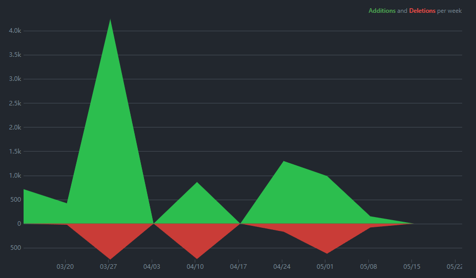
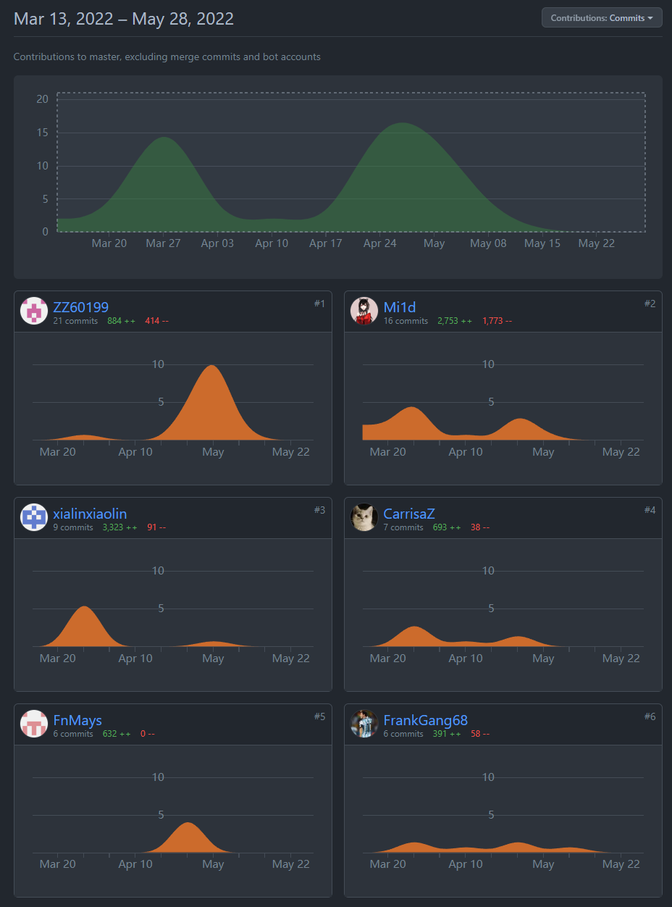
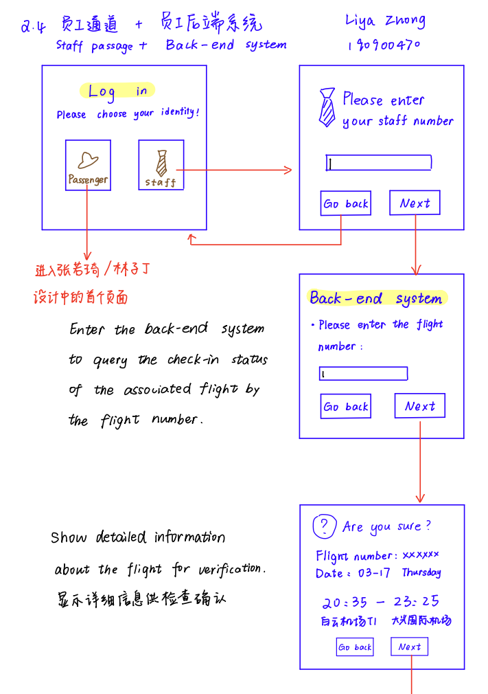
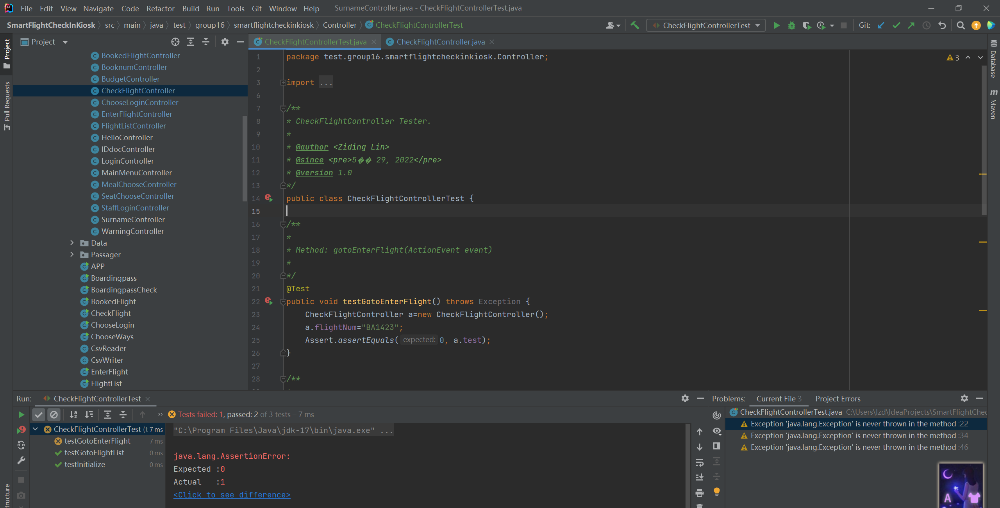
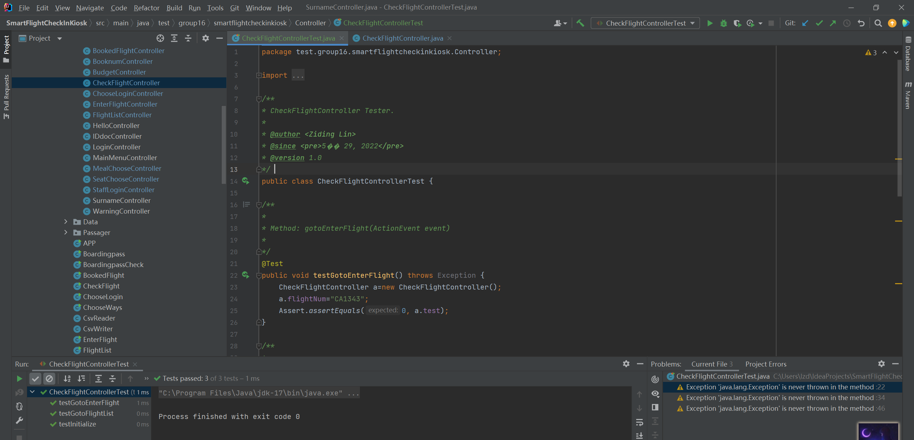

<!-- 让表格居中显示的风格 -->

# Software Engineering Group Project Final Report

  
Group 16

 

| Name         | BUPTNumber | QMNumber  |
|:-------------|:----------:|:---------:|
| Xiaoyi Liang | 2019213029 | 190898395 |
| Ruoqi Zhang  | 2019213236 | 190900311 |
| Ruibo Gang   | 2019213129 | 190897756 |
| Zhishang Yu  | 2018212708 | 190015671 |
| Ziding Lin   | 2019213116 | 190898421 |
| Liya Zhong   | 2019213243 | 190900470 |

## 1.Introduction
The aim of this project is to develop a smart kiosks in front of its check-in desks at the London Heathrow Airport. The system is developed with Agile methods. To develop this system, we first have meetings to brainstorm
for specific requirements. Then we use some fact-finding techniques such as interviews, observation,
questionnaire and so on to make the requirements clear and accurate enough. Then we write java code
through iterative development. At the end, we improve the user interface and produce some documents like
user manuals. We hope every user of this software and our customer can be satisfied with this software.

## 2.Project management
### 2.1 Project Planning
This project adopts agile development method and agile project management process.Our development work is carried out according the recommendations in [Handout](https://qmplus.qmul.ac.uk/pluginfile.php/2604460/mod_resource/content/3/EBU6304_GroupProjectHandout_2022.pdf)
There maybe a little error of a few days when truly implement each iteration.Before beginning of each iteration, we took a group meeting to review the dependency analysis and the
activity network in project planning step to double check the dependencies between each task which is vital
in making a schedule. And you could get our meeting minutesin detail from our [QMplus hub Journals](https://hub.qmplus.qmul.ac.uk/artefact/blog/index.php?group=3633)
In this project, we used [JavaFX](https://openjfx.io/) to complete the GUI design, [Maven](https://maven.apache.org/) to manage the project and related packages, and [Github](https://github.com/SE-of-nobody/SmartFlightCheckInKiosk) to complete the team collaboration, version control and contribution statistics of the code.

| Date             |                                                     Task                                                     |
|:-----------------|:------------------------------------------------------------------------------------------------------------:|
| 11-15 March      |                         Set up the QMPlus Hub group and discuss the project handout.                         | 
| 16-18 March      |                       Story writing workshop. Outcomes: product backlog and prototype                        |   
| 21 March-1 April |                Iteration 1 Complete most basic logic and functionality in the back-end design                |   
| 4-15 April       |                                 Iteration 2 Complete most of the GUI design                                  |   
| 18-29 April      |             Iteration 3 Complete building controllers that connect the different stage together              |  
| 2-13 May         | Iteration 4 Complete the docking work of Boradingpass part and supplement the logical code of the staff part |   
| 16-30 May        |                             Iteration 5 Complete appearance design and bug fixes                             |    

It is easy to see that a significant periodicity in our submissions from [Github's](https://github.com/SE-of-nobody/SmartFlightCheckInKiosk) code frequency

### 2.2 Managing people
In terms of people management, we divide the work according to the interest of
different students. We use the way of team competition to motivate the members, and
the students who finish the task the fastest will be rewarded. We adhere to the principles
of consistency, respect, inclusion and honesty for team members.

| Subgroup |                                     Members |                                                            Task                                                             |
|:---------|--------------------------------------------:|:---------------------------------------------------------------------------------------------------------------------------:|
| Group1   | Xiaoyi Liang Ruibo Gang Ruoqi Zhang |     In part Passenger, complete GUI design, code writing page and iteration, which including jump of the page and alert     |
| Group2   |                                  Liya Zhong |                            In part Staff, complete GUI design, code writing page and iteration.                             |
| Group3   |                                  Ziding Lin | In part Passenger, complete writing and iterating back-end code, which including login, transfer parameters and junit test. |
| Group4   |                                 Zhishang Yu |   In part Staff, complete writing and iterating back-end code, which including login, transfer parameters and junit test.   |

Otherwise, we use [Github](https://github.com/SE-of-nobody/SmartFlightCheckInKiosk)   recording everyone's commit.Of course, we also made a submission on QMhub

Contribution in [Github](https://github.com/SE-of-nobody/SmartFlightCheckInKiosk) has a delay in counting submissions from the last two weeks, which means The data in the picture is for reference only.
### 2.3 Risk Management
In this project, we may encounter project risks and product risks. For the project risks, the approach we
took was to give the team members enough time. If one person can't get things done on time, others have
plenty of time to take over and get things done. Therefore, our schedule is slightly different from the
recommended schedule. For the product risks, we take the approach of multiple iterations + multiple
evaluations. At the end of each iteration, we would discuss the shortcomings of this iteration in the Wechat and evaluate our design and implementation. Once a problem is identified, it will be improved in
the next iteration. If a serious problem is found during the iteration, we do not change the plan in the
middle of the iteration, but choose to fix the problem in the next iteration. In fact, we did encounter a
serious problem and solved it using this method. Please see our weekly journals for details.
## 3.Requirements
### 3.1 Apply the requirements finding techniques
In this project, we used [JavaFX](https://openjfx.io/) to complete the GUI design, [Maven](https://maven.apache.org/) to manage the project and related packages, and [Github](https://github.com/SE-of-nobody/SmartFlightCheckInKiosk) to complete the team collaboration, version control and contribution statistics of the code.
### 3.2 User stories
In terms of user stories, we produce a large number of user stories, delete a batch through meetings, and
then evaluate and priorities the remaining parts.
We chose a different ID for each story.  According to the Specification in Handout, we chose different three-digit numbers.  Where the leading number indicates which part they belong to:

| ID  |      Category      |
|:----|:------------------:|
| 1   |      Check-in      | 
| 2   |   Extra options    |   
| 3   |   Boarding pass    |   
| 4   |  Passengers list   |   
| 5   | Other requirements |   

Different second digits indicate that they belong to different problems, and the third digit represents different details of the same problem.

| Story ID |                         Story Name |                                                           Description                                                            | Iteration version number |
|:---------|-----------------------------------:|:--------------------------------------------------------------------------------------------------------------------------------:|:------------------------:|
| 111      |                         check in 1 |                                               information by input booking number                                                |            1             |
| 112      |                         check in 2 |                        passengers can get their flight booking information by input surname and ID number                        |            1             |
| 113      |                         check in 3 |                         passengers can get their flight booking information by scanning the ID document                          |            1             |
| 114      |                         check in 4 |                           passengers can get their flight booking information by input booking number                            |            3             |
| 121      |                     flight summary |                                  system will show the summary of the flight booking information                                  |            1             |
| 131      |                      choose seat 1 |                                        passengers can choose the seat through the screen                                         |            1             |
| 132      |                      choose seat 2 |                                                     the seat has been chosen                                                     |            1             |
| 133      |                        choose meal |                                                  passengers can choose the meal                                                  |            1             |
| 134      |                            confirm |                                           passengers scan the ID document and confirm                                            |            1             |
| 211      |                    Extra options 1 |                                  choose special seating（ seat with extra legroom，gourmet menu）                                   |            1             |
| 212      |                    Extra options 2 |                                 ·Payment interface（ enter the details of customer's credit card)                                 |            2             |
| 213      |                    Extra options 3 |                                       ·final confirmation screen(information confirmation）                                       |            1             |
| 221      |                     Payment method |                                                    ·Multiple payment methods                                                     |            3             |
| 231      |      Operation interface interface |                                                        ·Visual seat style                                                        |            1             |
| 241      |              Service Customization |                                                 ·Service types can be customized                                                 |            1             |
| 311      |                    Boarding pass 1 |                           Passenger wants to get her/his boarding pass so she/he can get on the plane                            |            1             |
| 321      |          Check-in status display 1 |                            Passenger wants to know where should she/he drop her/his check-in packages                            |            2             |
| 322      |          Check-in status display 2 | passenger wants to change the number of the checkin packages because she/he hadn't count them correctly when booking the tickets |            3             |
| 411      |          Check-in status display 3 |                         Flight attendant can check the information of the passengers on a given flight.                          |            1             |
| 412      |          Check-in status display 4 |                       Flight attendant can check the check-in status of the passengers on a given flight.                        |            1             |
| 413      |          Check-in status display 5 |                       Flight attendant can easily count and focus on the unchecked passengers on the page.                       |            3             |
| 421      | Urgent reminder of late check-in 1 |                             Airport check-in staff can check check-in status of all upcoming flight.                             |            2             |
| 422      | Urgent reminder of late check-in 2 |             Airport check-in staff can easily focus on the unchecked passengers of all upcoming flight on the page.              |            3             |
| 423      | Urgent reminder of late check-in 3 |  Airport check-in staff can remind the uncheck-in passengers on departing flights within 30 minutes to check in by  broadcast.   |            4             |

### 3.3 Iterations planning
We plan our iterations according to the suggested Timeline in handout. There is error of a few days when
truly implement each iteration.

| Date             |                                                     Task                                                     |
|:-----------------|:------------------------------------------------------------------------------------------------------------:|
| 21 March-1 April |                Iteration 1 Complete most basic logic and functionality in the back-end design                |   
| 4-15 April       |                                 Iteration 2 Complete most of the GUI design                                  |   
| 18-29 April      |             Iteration 3 Complete building controllers that connect the different stage together              |  
| 2-13 May         | Iteration 4 Complete the docking work of Boradingpass part and supplement the logical code of the staff part |   
| 16-30 May        |                             Iteration 5 Complete appearance design and bug fixes                             |    

### 3.4 Prototype
Depending on each person's job assignment, we will design the relevant GUI ourselves. Most of Prototype's designs were hand-drawn, which made our designs easier and more creative.

  
Some screenshots of Prototype

As development progressed, our requirements changed, so the prototype was modified or redone many times. With these prototypes, developers can feel comfortable knowing what the software should be designed
to look like. Interactive prototypes allow developers to understand the logical structure of the user
interface. Moreover, these prototypes contain art materials and color schemes. This makes our software
more beautiful.

### 3.5 Adapt to changes
During the procedure of our project, there are plenty of changes in our initial iteration plan. For example, in the initial brainstorming we only discussed the implementation of the individual feature pages. When we linked the pages together, we realized that there were too many unnecessary page jumps, so we redesigned the main menu.
In addition, when designing the function of page jump, we also encountered a lot of difficulties, so we designed different schemes.  In the end, we adopted Ruibo Gang's solution to ensure smooth parameter transfer.
We have a routine meeting every week held by our team leader. During the conference, everyone put
forward their opinions toward the current project, for instance, problems meet when implement with code
and possible adjust to the requirement analysis. Then, the meeting recorder will log all these confusions and
we will have a fierce discussion to them. As a result, we may change in our product backlog and user stories
after the meeting.  

## 4.Analysis and Design
### 4.2 Design Principle
1. Single Responsibility Principle (SRP)

   Each class in our system fulfills the single responsibility principle. Since we use JavaFX to design the system, our java classes are all distinguished by modules and services. GUI is divdided into two parts, Controller and FXML document. Each control class is only responsible for one action and each FXML is related to only one controller.
2. Open-Closed Principle (OCP)

   Our software entity is open to extension and closed to modification, which means that a software entity should be changed by extension rather than by modifying existing code. The controller classes in our project conform to this principle because we just need to add the new extension to the original class without modifying it.
3. Don't Repeat Yourself (DRY)

   To avoid duplication, we always create a separate class to implement a function used frequently, such as the Jumpto class which is used by all the GUI controller to jump to other GUI. So if there is any change to this function, just modify the Jumpto class, for example.
## 5.Implementation and Testing
### 5.1 Implementation
#### 5.1.1 Implementation Strategy
We have divided the back-end code into two parts: passenger and staff, which will be introduced to you in turn below. At the beginning of the code, we unified the variable name and function name in the code.  
We use object-oriented programming (Java language), which includes class definition and methods’ definition.  
We use different kinds of mapping, such as association (including one-to-one and one-to-many) and  inheritance.  

#### 5.1.2 Iteration Plan
##### Iteration 1:  
In this version, we implemented the first version of the back-end code. In this version of the back-end code, most functions can be realized, including customer login, meal selection, seat selection, credit card verification and settlement, etc.  
However, in this version, we use the database to complete the interactive transfer of various data and the storage of user data. The existence of database makes the back-end code of the whole program become miscellaneous and cumbersome, which is not suitable for the combination of back-end and front-end. At the same time, it does not meet the requirements of our course.  
Therefore, we abandoned this version of back-end design in subsequent iterations and adopted better back-end code.  

##### Iteration 2:  
In this version, we complete the GUI design of the front end. We designed the GUI according to the functions implemented by the back-end code in the first iteration. At this time, the connection jump problem of the front-end GUI has been solved. And try to connect and merge the back-end and front-end code.  
During the connection, we found some problems with the back-end code, such as the monotonous login mode and the transmission of user data with the front-end, such as selecting meals and seats. We have summarized many problems and put forward improvement measures for these problems.  

##### Iteration 3:  
In this version, we follow up the back-end code to make the back-end code simple and easy to call. We have rewritten the back-end code, discarding most of the code in the first and second iterations and the way of data transmission. In the new back-end code, we have implemented a variety of login methods for users, including logging in through booking number; Log in through surname and ID number; And login through the ID document. At the same time, we also realize the function of user's personal information query. After the user selects the meal and seat, the data will be returned to the CSV file for modification. Users can also query through the front end.  
For the front-end part, we have improved the GUI style and basically solved the connection problem between GUIs. At the same time, we added the code of the controller part to facilitate the integration of the back end and the addition of functions in the next iteration.  

##### Iteration 4:  
In this version, we have added some new user data, including the arrival time of the flight, the user's round-trip City, etc. These data can be displayed through the information query function, and the user can directly see these data, so that they can verify their own information. At the same time, we have also added the bill function. Users can view their seats, meals and other information on the bill.  
We also improved the settlement interface. In the settlement interface, users can see the types and prices of meals and seats they have selected. The program will provide a credit card input box for the user. The user only needs to input his credit card number to complete the payment. Of course, if the card number is entered incorrectly or the balance in the card is insufficient, an error will be reported.   
In the GUI interface, we added a error prompt. For example, when a user logs in, if he enters the wrong booking number, an error prompt window will pop up. At this time, the user needs to re-enter. We also beautify the entire operation interface to make it look more concise and beautiful.  

##### Iteration 5:
In this version, we have improved some code and tested it to improve the jump and display between pages. We also completed the testing and adjustment of the whole system.   

### 5.2 Testing
#### 5.2.1 Test Strategy
Our strategy is to divide the code into front-end and back-end parts, which are completed by 4 students and 2 students respectively.Our aim is to verify the results from the implementation stage by testing each software build. We test the software in both component level and integration level.   
At the beginning, we simulated the software usage scenarios and designed many different schemes and corresponding functional programs,including valid user inputs and invalid user inputs.   
Second, we identify and structure test procedures. We try to reuse existing test procedures and create generic test procedures. First, we change register part to register a new account. After that we this account to we check login, including correct and incorrect input check. Then we go to the home screen to check different sections (which is mapping to different functions).   
Finally, we find defects for the system.   

#### 5.2.2 Test techniques
We use black boxes test to test the software requirements and use white box test to test the internal program logic.
##### Black-box test:
We use partition test, scenario-based testing and regression testing to test the functional requirements for
the whole system. Then whole test process will be put in Appendix D. Therefore, we only put an example
here. 
##### White-box test:
We use white-box test to test all statements and conditions. Here is one of the examples of our white-box test.   
Normal user login test: We use white-box test technology to test all the paths.   

#### 5.2.3 The Using of TDD
We use Test Driven Development to develop the entity and control part of our system. We write tests prior
to write the production code. Then we write codes, execute the test, make change of the codes and execute
the test again until pass all the tests.  
Here are examples about our code passing the test.  

  
example of false input

  
example of true input

## 6.Appendix
### Appendix-1 References
[1] [Github](https://github.com/SE-of-nobody/SmartFlightCheckInKiosk)  
[2] [Intro of Software Engineering by QMUL](https://qmplus.qmul.ac.uk/pluginfile.php/2574097/mod_resource/content/8/EBU6304_W1_Live_Introduction%20to%20Software%20Engineering_student.pdf)  
[3] [TDD by QMUL](https://qmplus.qmul.ac.uk/pluginfile.php/3179540/mod_resource/content/2/EBU6304_W6_Rec_TDD%20Demo%20-%20Mac%20Console%20Launcher.pdf)  
[4] [Development by QMUL](https://qmplus.qmul.ac.uk/pluginfile.php/3179536/mod_resource/content/3/EBU6304_W6_Rec_Test%20Driven%20Development.pdf)  
[5] [Implementation&Testing by QMUL](https://qmplus.qmul.ac.uk/pluginfile.php/2619548/mod_resource/content/3/EBU6304_W5_Rec_Implementation_Testing.pdf)  
[6] [Architecture by QMUL](https://qmplus.qmul.ac.uk/pluginfile.php/2611288/mod_resource/content/3/EBU6304_W4_Rec2_Software%20Architecture.pdf)  
[7] [Design by QMUL](https://qmplus.qmul.ac.uk/pluginfile.php/2586898/mod_resource/content/3/EBU6304_W4_Rec1_Design.pdf)  
[8] [Processes&Agile by QMUL](https://qmplus.qmul.ac.uk/pluginfile.php/2574104/mod_resource/content/6/EBU6304_W1_Rec_Processes_and_Agile.pdf)  
[9] [Handout](https://qmplus.qmul.ac.uk/pluginfile.php/2604460/mod_resource/content/3/EBU6304_GroupProjectHandout_2022.pdf)
[10] [JavaFX](https://openjfx.io/)
[11] [Maven](https://maven.apache.org/)
### Appendix-2 Main Screenshots
