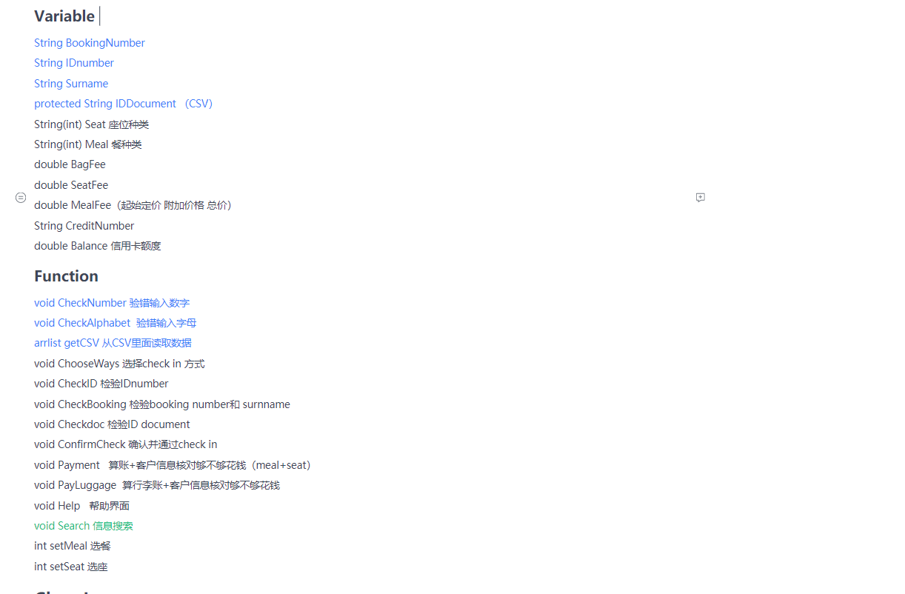
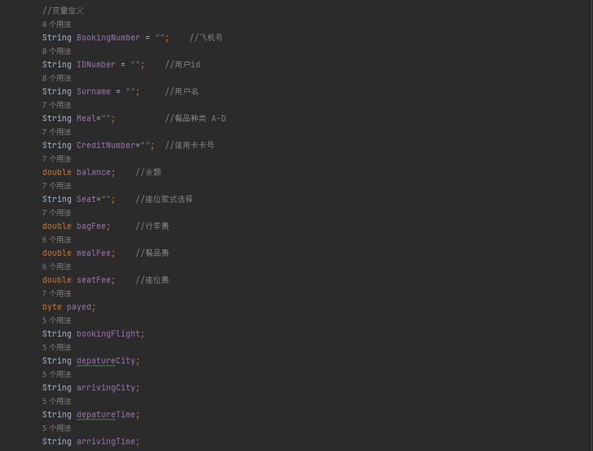

# Project management
## Back-end
We have divided the back-end code into two parts: passager and staff, which will be introduced to you in turn below.At the beginning of the code, we unified the va
riable name and function name in the code, as shown in the following figure.

### passager

In the passager section, we use the following variables

    The following functions are implemented in the passager section:
        There are three login methods for users: 
        The first is to login through booking number; 
        The second method is to log in through surname and ID number; 
        The third method is to log in through ID document.
    After logging in, users can find their own user information in the interface, and can personalize their seats and dining styles, and provide a settlement method.
    
    In this part of the code, we create two CSV files to store the user's relevant data. They are data CSV and login CSV, where data CSV contains all the data of users, such as their booking number, surnamr, flight arrival time, arrival city and other related information, while login CSV contains only a small amount of information, such as booking number and surnamr, for the third login method. Including a small amount of information does not reduce the accuracy of verification, but reduces the complexity of the code and optimizes part of the code.
    After the user logs in and selects catering and seating, the changed data will be synchronously updated to data CSV file.
# Requirements

# Analysis and Design

# Implementation and Testing