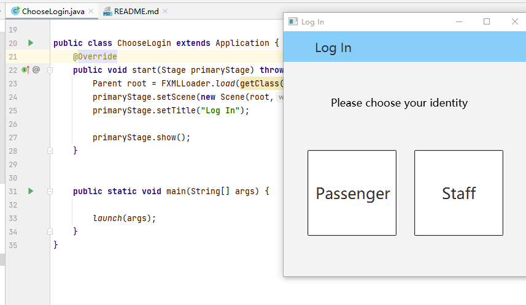

# SmartFlightCheckInKiosk

## 1.Choose Login

Chooselogin.java is the entry point of the entire project. By running this class, you can choose to log in as a passenger or as an employee

## 2.Passenger

Click passenger and then enter the passenger's login page. On this page, you can choose three ways to check-in

### 2.1Log in

The first method is to click the first button" Booking Number" and you can enter the check-in of different people through the book number in the following table:

| 123456 | JACK |
| ------ | ---- |
| 123457 | ROSE |
| 123458 | TOM  |
| 123459 | MIKE |

The second method is to click the second button "Surname&ID number" and enter the surname and id number. You can enter the check-in of different people through the surname and ID number in the following table:

| ID number | Surname |
| --------- | ------- |
| 01        | JACK    |
| 02        | ROSE    |
| 03        | TOM     |
| 04        | MIKE    |

The third method is to click the third button and scan the id-card. We use the "login.csv" in the project as the id-card information entered by the passenger, so you can click ok to directly enter the subsequent interface, and click "back "at the bottom You can go back to the previous ChooseLogin interface.

### 2.2 Extra Options 

After logging in,  there is the main menu page, where you can see the booking information. The subsequent operations can be performed in the upper menu bar. 

First, you can directly return to the "ChooseLogin" page from Login-Quit. The second tab is "Choose" where passengers can choose meals and seats at Meal and Seat. The selected item button will turn blue.

The selected meal and seat and the amount to be paid can be seen in the third tab "Budget", enter the credit card number, click "ok" to pay, if the number is wrong, it will display "sorry, your car number is not correct" , if the balance is insufficient, it will display "sorry, your balance is not enough", if the payment is successful, it will display "successfully paid!O(∩_∩)O", and the text on the "ok" button will be grayed out and cannot be clicked.

 The table below shows passengers and their account numbers and balances

| Surname | Credit number | balance |
| ------- | ------------- | ------- |
| JACK    | 666           | 100.0   |
| ROSE    | 777           | 225.0   |
| TOM     | 888           | 200.0   |
| MIKE    | 999           | 100.0   |

### 2.3 Boarding pass

The fourth tab is  "boarding" which is the last step of the passenger's "check in" (note that the ticket and other information can be printed out normally only after the extra charge been successfully paid)

First, the boarding page will display the boarding information including the seat selected by the passenger and the meal information (if no seat is selected, "please choose your seat first" will be displayed in the "Seat" line). Click the "ok" button on this page to enter the next  page (if there is an unfinished payment or seat selection, you are not able to go to the next page)

The second page is a notification page, notificating passengers that three items would be printed out:the boarding pass, the ticket corresponding to each check-in baggage, and the tag corresponding to each carry-on baggage

Click "ok" to print out the above items. There is a boardingpass window, each carry-on baggage corresponds to a boardingpass-tag window (with the tag name starting with CO), and each check baggage corresponds to a boarding-ticket window (with counter and tag name starting with CI) 

The following table shows the " owner, tag name, counter number, category" of each luggage

| owner | tag  | counter | type(1.check-in 2.carry-on) |
| ----- | ---- | ------- | --------------------------- |
| JACK  | CI1  | 01      | 1                           |
| JACK  | CI2  | 01      | 1                           |
| JACK  | CI3  | 02      | 1                           |
| JACK  | CO1  |         | 2                           |
| JACK  | CO2  |         | 2                           |
| JACK  | CO3  |         | 2                           |
| JACK  | CO4  |         | 2                           |
| ROSE  | CI4  | 01      | 1                           |
| ROSE  | CI5  | 01      | 1                           |
| TOM   | CI6  | 01      | 1                           |
| TOM   | CO5  |         | 2                           |

## 3.Staff

Go back to the ChooseLogin page, and then click on "Staff" to enter the staff pages. This back-end system allows staff to inquire the information of a certain flight and the"passenger list" of all passengers who have booked this flight. The passenger list includes: Passenger's name, passenger's seat, whether the passenger have checked in

### 3.1 Passenger list

First enter the employee password "123" (if the input is wrong, an error message will appear) and then select a flight (you can enter CA1343 or EC3434), click "next" to enter the page that displays the flight information you are looking for, click "next" to display Passenger list for this flight